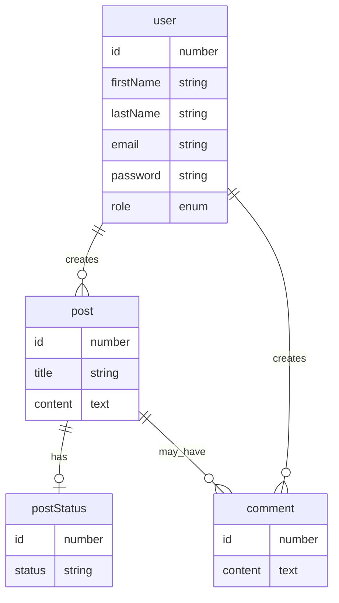

### Ressursid

### Endpoindid

### API töötamise kontrollimiseks
- `GET /api/v1/health/`

### Registreerumine ja sisselogimine
- Registreerumine: `POST /api/v1/register/`
- Sisselogimine: `POST /api/v1/login/`

### Kasutajatega seotud
- [Kasutajate pärimine](./endpoints/users/get.md#list-of-users): `GET /api/v1/users/`
- [Kasutaja pärimine id alusel](./endpoints/users/get.md#user-by-id): `GET /api/v1/users/:id/`
- Kasutaja loomine: `POST /api/v1/users/`
- Kasutaja muutmine: `PATCH /api/v1/users/:id/`
- Kasutaja kustutamine: `GET /api/v1/users/:id/`

### Postitustega seotud
- Postituste pärimine: `GET /api/v1/posts/`
- Postituse pärimine id alusel: `GET /api/v1/posts/:id/`
- Postituse loomine: `POST /api/v1/posts/`
- Postituse muutmine: `PATCH /api/v1/posts/:id/`
- Postituse kustutamine: `GET /api/v1/posts/:id/`
- Postitusega seotud kommentaaride pärimine postituse id alusel: `GET /api/v1/posts/:id/comments/`

## Postituse staatusega seotud
- Postituse staatuste pärimine: `GET /api/v1/posts/statuses/`
- Postituse staatuse pärimine id alusel: `GET /api/v1/posts/statuses/:id/`

### Kommentaaridega seotud
- Kommentaaride pärimine: `GET /api/v1/comments/`
- Kommentaari pärimine id alusel: `GET /api/v1/comments/:id/`
- Kommentaari loomine: `POST /api/v1/comments/`
- Kommentaari kustutamine: `GET /api/v1/comments/:id/`
