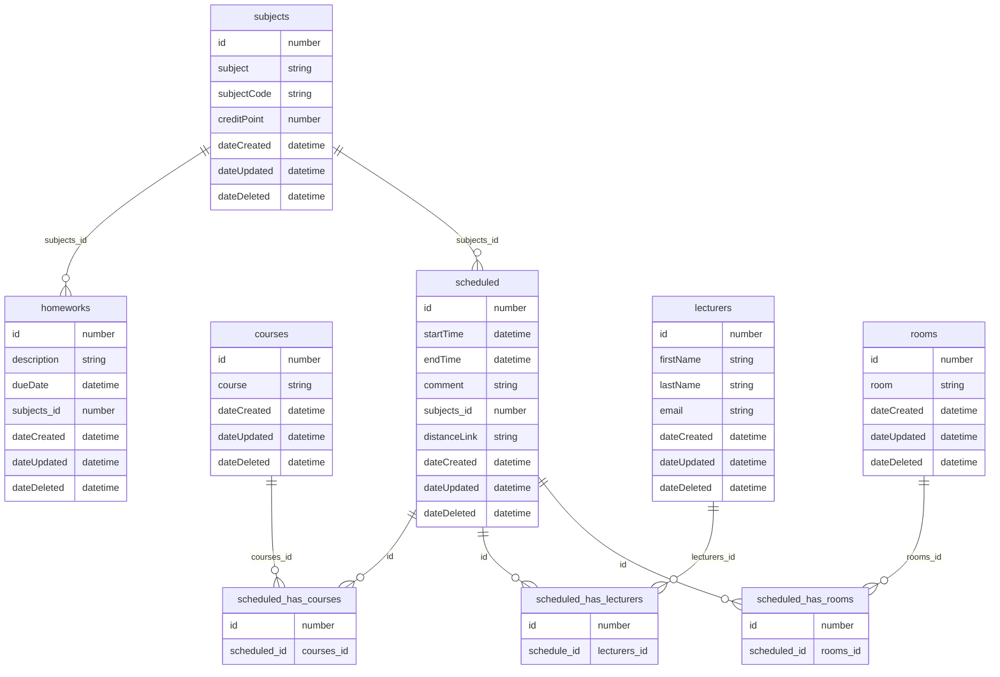

### Ressursid

### Endpoindid

### API töötamise kontrollimiseks
- `GET /api/ping/`

### Tunniplaaniga seotud
- [Tunniplaani päring pärimine](./endpoints/users/get.md#list-of-users): `GET /api/schedule/`
- [Tunniplaani päring pärimine alates kuupäevast](./endpoints/users/get.md#user-by-id): `GET /api/schedule/:atDate`
- [Tunniplaani päring pärimine alates kuupäevast kuni kuupäevani](./endpoints/users/get.md#user-by-id): `GET /api/schedule/:atDate/:toDate`
- Uue loengu aja lisamine: `POST /api/schedule/`
- Loengu aja muutmine: `PATCH /api/schedule/:id`
- Loengu aja kustutamine: `DELETE /api/v1/users/:id/`

### Õppejõuga seotud

## Õppeainega staatusega seotud

### Kursusega seotud

### Ruumiga seotud

